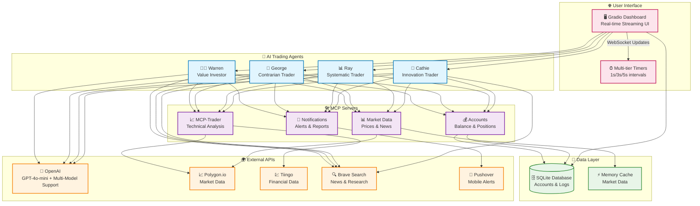
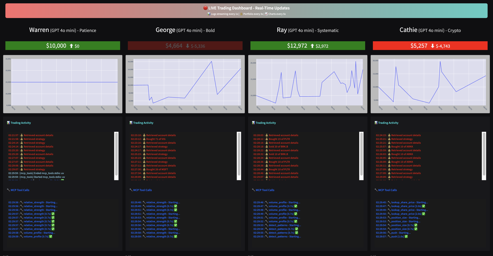

<div align="center">

# 🤖 Trading Agent with MCPs

[](https://www.python.org/downloads/)
[](https://opensource.org/licenses/MIT)
[](https://gradio.app/)
[](https://openai.com/)
[](https://docs.astral.sh/uv/)
[](https://modelcontextprotocol.io/)

**🔴 LIVE AI Trading Agents with Real-Time Streaming Dashboard**

*Four unique AI personalities trading autonomously with professional-grade tools*

> ⚠️ **Repository Setup Required**: This README contains placeholder URLs (`your-username`, `your-domain`, etc.) that need to be updated with actual repository information before publishing.

[🚀 Quick Start](#-quick-start) • [📊 Live Demo](#-live-demo) • [🏗️ Architecture](#️-system-architecture) • [📖 Documentation](#-documentation) • [🤝 Contributing](#-contributing)

</div>

---

## 📋 Table of Contents

- [✨ Features](#-features)
- [🚀 Quick Start](#-quick-start)
- [🏗️ System Architecture](#️-system-architecture)
- [🤖 AI Trading Agents](#-ai-trading-agents)
- [⚙️ Installation Guide](#️-installation-guide)
- [🔧 Configuration](#-configuration)
- [🎯 Usage Examples](#-usage-examples)
- [📊 Live Demo](#-live-demo)
- [🛠️ MCP Servers](#️-mcp-servers)
- [🔗 API Integrations](#-api-integrations)
- [📖 Documentation](#-documentation)
- [🤝 Contributing](#-contributing)
- [📄 License](#-license)

---

## ✨ Features

### 🤖 **AI-Powered Trading Agents**
- **4 Unique Personalities**: Warren (Value), George (Contrarian), Ray (Systematic), Cathie (Innovation)
- **Real-time Decision Making**: Every 10 seconds to 1 hour (configurable)
- **Professional-grade Analysis**: Technical indicators, pattern recognition, risk management

### 📊 **Live Streaming Dashboard**
- **Real-time Updates**: Logs stream every 1s, portfolio every 3s, charts every 5s
- **Dual-view Interface**: Trading activity + MCP tool calls
- **Interactive Charts**: Portfolio performance, holdings, transaction history
- **Status Monitoring**: Live system health and performance metrics

### 🛠️ **Advanced MCP Integration**
- **MCP-Trader Server**: Custom technical analysis tools
- **Account Management**: Real-time balance and position tracking
- **Market Data**: Multiple data providers with fallback support
- **Notification System**: Mobile alerts via Pushover

### 🔧 **Production Ready**
- **UV Package Manager**: Fast, reliable dependency management
- **Database Persistence**: SQLite with real-time logging
- **Error Handling**: Robust fallback mechanisms
- **Real-time Monitoring**: System health and performance metrics

---

## 🚀 Quick Start

Get up and running in under 5 minutes:

```bash
# 1. Clone the main repository
git clone https://github.com/your-username/Trading-Agent-with-MCPs.git
cd Trading-Agent-with-MCPs

# 2. Clone the MCP-Trader server (required dependency)
git clone https://github.com/wshobson/mcp-trader.git

# 3. Install UV (if not already installed)
curl -LsSf https://astral.sh/uv/install.sh | sh

# 4. Set up environment
cp .env.example .env
# Edit .env with your API keys (see Configuration section below)

# 5. Install dependencies
uv sync

# 6. Set up MCP-Trader and build
cd mcp-trader && cp .env.example .env && uv sync && uv build && cd ..

# 7. Create required directories and initialize
mkdir -p memory
uv run python reset.py

# 8. Launch services
uv run python app.py &          # Dashboard in background
uv run python trading_floor.py & # Trading floor in background

# 9. Open your browser
open http://127.0.0.1:7860
```

> 🎯 **First Time?** Check out our [Detailed Installation Guide](#️-installation-guide) below!

---

## 🏗️ System Architecture



### 🔄 **Data Flow**

1. **🎯 Trigger**: Timer triggers trading cycle (configurable frequency)
2. **🧠 Research**: AI agents research markets via Brave Search + financial APIs
3. **📊 Analysis**: MCP-Trader provides technical analysis and risk metrics
4. **💭 Decision**: AI models (GPT-4o-mini by default) process data and make trading decisions
5. **💰 Execution**: Account MCP executes trades and updates balances
6. **📱 Notification**: Push notifications sent for significant events
7. **🖥️ Display**: Real-time UI updates show all activity live

---

## 🤖 AI Trading Agents

Each agent has a unique personality and trading approach:

### 👨‍💼 **Warren - The Value Investor**
- **Philosophy**: "Price is what you pay, value is what you get"
- **Strategy**: Long-term value investing, dividend stocks, defensive picks
- **Tools**: Fundamental analysis + technical confirmation
- **Risk**: Conservative, focuses on preserving capital

### 🎯 **George - The Contrarian**
- **Philosophy**: "Be greedy when others are fearful"
- **Strategy**: Contrarian plays, macro trades, bold bets
- **Tools**: Sentiment analysis + oversold technical signals
- **Risk**: Aggressive, wide stops for contrarian positions

### 📊 **Ray - The Systematic**
- **Philosophy**: "Systematic rules remove emotion from trading"
- **Strategy**: Diversified ETFs, risk-parity, systematic rebalancing
- **Tools**: Technical indicators + systematic entry/exit rules
- **Risk**: Balanced, risk-adjusted position sizing

### 🚀 **Cathie - The Innovator**
- **Philosophy**: "Innovation creates explosive growth opportunities"
- **Strategy**: Growth stocks, crypto, breakthrough technologies
- **Tools**: Momentum analysis + innovation thesis research
- **Risk**: High volatility tolerance, innovation-focused stops

---

## ⚙️ Installation Guide

### 📋 **Prerequisites**

- **Python 3.12+** - [Download Python](https://www.python.org/downloads/) *(Main project requirement)*
- **Python 3.11+** - *Minimum requirement for MCP-Trader subproject*
- **UV Package Manager** - [Install UV](https://docs.astral.sh/uv/getting-started/installation/)
- **Git** - [Install Git](https://git-scm.com/downloads)

> 📝 **Note**: Python 3.12+ is recommended for full compatibility across all components.

### 🛠️ **Step-by-Step Installation**

#### 1️⃣ **Clone Repositories**
```bash
# Clone the main trading agent repository
git clone https://github.com/your-username/Trading-Agent-with-MCPs.git
cd Trading-Agent-with-MCPs

# Clone the MCP-Trader server (required for technical analysis)
git clone https://github.com/wshobson/mcp-trader.git
```

> 📝 **Note**: The [MCP-Trader server](https://github.com/wshobson/mcp-trader) by [@wshobson](https://github.com/wshobson) provides essential technical analysis tools for our AI agents.

#### 2️⃣ **Install UV (if needed)**
```bash
# macOS/Linux
curl -LsSf https://astral.sh/uv/install.sh | sh

# Windows
powershell -ExecutionPolicy ByPass -c "irm https://astral.sh/uv/install.ps1 | iex"

# Or via pip
pip install uv
```

#### 3️⃣ **Set Up Environment**
```bash
# Copy environment template
cp .env.example .env

# Edit with your API keys
nano .env  # or use your preferred editor
```

#### 4️⃣ **Install Dependencies**
```bash
# Sync all dependencies (fast!)
uv sync

# Verify installation
uv run python -c "print('✅ Installation successful!')"
```

#### 5️⃣ **Set Up MCP-Trader**
```bash
# Navigate to MCP-Trader directory and set up
cd mcp-trader
cp .env.example .env
# Add your Tiingo API key to mcp-trader/.env (same as main .env)
uv sync
# Build the MCP-Trader package (CRITICAL STEP!)
uv build
cd ..  # Return to main directory
```

#### 6️⃣ **Create Required Directories**
```bash
# Create memory directory for trader databases
mkdir -p memory
```

#### 7️⃣ **Initialize Database**
```bash
# Reset/initialize trading accounts
uv run python reset.py
```

---

## 🔧 Configuration

> 📝 **Quick Setup**: Copy `.env.example` to `.env` and add your API keys:
> ```bash
> cp .env.example .env
> # Then edit .env with your actual API keys
> ```

### 🔑 **Required API Keys**

Get your free API keys from these providers:

| Service | Purpose | Link | Required |
|---------|---------|------|----------|
| 🤖 **OpenAI** | AI trading agents | [Get API Key](https://platform.openai.com/account/api-keys) | ✅ **Yes** |
| 📊 **Polygon.io** | Real-time market data | [Get API Key](https://polygon.io/dashboard/api-keys) | ✅ **Yes** |
| 💹 **Tiingo** | Technical analysis data | [Get API Key](https://api.tiingo.com/) | ✅ **Yes** |
| 📈 **MCP-Trader** | Technical analysis server | [Setup Guide](https://github.com/wshobson/mcp-trader#setup) | ✅ **Yes** |
| 🔍 **Brave Search** | Market research | [Get API Key](https://api.search.brave.com/) | ✅ **Yes** |
| 📱 **Pushover** | Mobile notifications | [Get Credentials](https://pushover.net/) | ⚪ Optional |

### ⚙️ **Trading Configuration**

Customize your trading behavior in `.env`:

```bash
# Trading frequency (in minutes)
RUN_EVERY_N_MINUTES=60        # Trade every hour

# Examples:
# RUN_EVERY_N_MINUTES=1440     # Once per day
# RUN_EVERY_N_MINUTES=10       # Every 10 minutes  
# RUN_EVERY_N_MINUTES=0.167    # Every 10 seconds (testing)

# Market hours
RUN_EVEN_WHEN_MARKET_IS_CLOSED=false  # false = only during market hours
```

### 🧠 **Advanced AI Configuration**

Enable multiple AI models for different traders (optional):

```bash
# Multi-Model Support (optional - uses different AI providers for each trader)
USE_MANY_MODELS=false              # Set to 'true' to enable
DEEPSEEK_API_KEY=your_key_here     # For DeepSeek V3 models
GOOGLE_API_KEY=your_key_here       # For Gemini 2.5 Flash models  
GROK_API_KEY=your_key_here         # For Grok 3 Mini models
OPENROUTER_API_KEY=your_key_here   # For additional model providers

# When USE_MANY_MODELS=true, each trader uses a different AI provider:
# Warren -> GPT 4.1 Mini | George -> DeepSeek V3 | Ray -> Gemini 2.5 | Cathie -> Grok 3
```

---

## 🎯 Usage Examples

### 🚀 **Basic Usage**

```bash
# Method 1: Two Terminals (Recommended for Development)
# Terminal 1: Start the real-time dashboard
uv run python app.py

# Terminal 2: Start the trading engine
uv run python trading_floor.py

# Method 2: Background Processes (Recommended for Production)
uv run python app.py &          # Dashboard in background
uv run python trading_floor.py & # Trading floor in background

# Open browser to http://127.0.0.1:7860
```

### 🔧 **Advanced Usage**

```bash
# Reset accounts to $10,000 each
uv run python reset.py

# Run with custom configuration
RUN_EVERY_N_MINUTES=30 uv run python trading_floor.py

# Debug mode with verbose output
uv run python trading_floor.py
```

### 📊 **Testing & Development**

```bash
# Rapid testing (trades every 10 seconds)
echo "RUN_EVERY_N_MINUTES=0.167" >> .env
echo "RUN_EVEN_WHEN_MARKET_IS_CLOSED=true" >> .env
uv run python trading_floor.py

# Production settings (trades every hour during market hours)
echo "RUN_EVERY_N_MINUTES=60" > .env
echo "RUN_EVEN_WHEN_MARKET_IS_CLOSED=false" >> .env

# Verify MCP-Trader is properly set up
cd mcp-trader && uv run python -m mcp_trader --help
```

### 🔧 **Troubleshooting**

#### **"No MCP tool calls yet..." in Dashboard**
```bash
# Check if TIINGO_API_KEY is set
grep TIINGO_API_KEY .env

# Ensure memory directory exists
ls -la memory/

# Restart services cleanly
pkill -f "python" && sleep 2
uv run python app.py &
uv run python trading_floor.py &
```

#### **"Connection closed" Errors**
```bash
# Ensure MCP-Trader is built
cd mcp-trader && ls -la dist/
# If no .whl file, run: uv build

# Check for missing dependencies
node --version && npm --version
uvx --version
```

#### **"Input should be a valid string" Errors**
- Add missing API key to `.env` file
- Restart trading floor: `pkill -f trading_floor.py && uv run python trading_floor.py &`

---

## 📊 Live Demo



*🔴 Live AI Trading Dashboard - Real-time streaming interface with four AI trading agents*

### 🖥️ **Dashboard Features**

- **📈 Real-time Portfolio Charts**: Live P&L tracking with interactive plots
- **💰 Account Balances**: Current cash + position values with color-coded P&L
- **📋 Holdings Table**: Real-time position updates with quantities
- **📜 Transaction Log**: Live trading activity with timestamps
- **🔧 MCP Tool Calls**: See AI decision-making process in real-time
- **⚡ Performance Metrics**: System health and execution timing

### 🎮 **Interactive Features**

- **🔴 Live Status**: Real-time indicators showing system activity
- **📊 Multi-timeframe Updates**: Different refresh rates for different data types
- **🎨 Color-coded Interface**: Easy-to-read status indicators
- **📱 Responsive Design**: Works on desktop, tablet, and mobile

---

## 🛠️ MCP Servers

The system uses **Model Context Protocol (MCP)** servers for modular functionality:

### 📈 **MCP-Trader** (by [@wshobson](https://github.com/wshobson))

> 🙏 **Credit**: This project uses the excellent [MCP-Trader server](https://github.com/wshobson/mcp-trader) created by [@wshobson](https://github.com/wshobson) for technical analysis capabilities.

```python
# Technical analysis tools (provided by MCP-Trader)
analyze_stock(symbol, timeframe)     # Full technical analysis
analyze_crypto(symbol)               # Cryptocurrency analysis  
relative_strength(symbol, benchmark) # Performance comparison
volume_profile(symbol)               # Support/resistance levels
detect_patterns(symbol)              # Chart pattern recognition
position_size(capital, volatility)   # Risk-based position sizing
suggest_stops(symbol, entry_price)   # Stop loss recommendations
```

**Features provided by MCP-Trader:**
- 📊 **Technical Indicators**: RSI, MACD, Bollinger Bands, Moving Averages
- 📈 **Pattern Recognition**: Support/resistance, trend analysis
- 💰 **Risk Management**: Position sizing, stop loss suggestions
- 🔄 **Multiple Data Sources**: Tiingo, Binance APIs with fallback support
- ⚡ **FastMCP Resources**: Direct market data access via `stock://` and `crypto://` URIs

### 💰 **Accounts Server**
```python
# Account management
get_balance(account_name)            # Current cash balance
get_holdings(account_name)           # Current positions
buy_shares(account, symbol, qty)     # Execute buy order
sell_shares(account, symbol, qty)    # Execute sell order
list_transactions(account)           # Transaction history
```

### 📊 **Market Data Server**
```python
# Market information
get_share_price(symbol)              # Current stock price
get_market_status()                  # Market open/closed status
get_company_info(symbol)             # Basic company data
```

### 📱 **Push Notification Server**
```python
# Alert system
send_push_notification(message)     # Mobile alerts
send_trading_alert(trade_details)   # Trade-specific notifications
```

---

## 🔗 API Integrations

### 📊 **Financial Data**
- **[Polygon.io](https://polygon.io/)** - Real-time stock prices, market data
- **[Tiingo](https://api.tiingo.com/)** - Technical indicators, historical data, crypto

### 🤖 **AI & Language Models**
- **[OpenAI](https://openai.com/)** - GPT-4o-mini and other AI models for trading decisions and analysis

### 🔍 **Research & News**
- **[Brave Search](https://search.brave.com/)** - Market news and company research
- **[Serper](https://serper.dev/)** - Additional search capabilities

### 📱 **Notifications**
- **[Pushover](https://pushover.net/)** - Mobile push notifications
- **[SendGrid](https://sendgrid.com/)** - Email alerts and reports

---

## 📖 Documentation

### 📚 **Core Documentation**
- **[System Architecture](docs/architecture.md)** - Detailed technical overview
- **[API Reference](docs/api.md)** - Complete API documentation
- **[Trading Strategies](docs/strategies.md)** - Agent personality deep-dive
- **[MCP Development](https://modelcontextprotocol.io/docs)** - Official MCP documentation for creating custom servers

### 🔧 **Development Guides**
- **[Contributing Guidelines](CONTRIBUTING.md)** - How to contribute
- **[Development Setup](docs/development.md)** - Local development environment
- **[Testing Guide](docs/testing.md)** - Running tests and validation
- **[Deployment Guide](docs/deployment.md)** - Production deployment

### 🆘 **Support & Troubleshooting**
- **[FAQ](docs/faq.md)** - Frequently asked questions
- **[Troubleshooting](docs/troubleshooting.md)** - Common issues and solutions
- **[Discord Community](https://discord.gg/your-server)** - Live community support
- **[GitHub Issues](https://github.com/your-username/Trading-Agent-with-MCPs/issues)** - Bug reports and feature requests

---

## 🤝 Contributing

We welcome contributions! Here's how to get started:

### 🚀 **Quick Contribution**

```bash
# 1. Fork the repository
git clone https://github.com/your-username/Trading-Agent-with-MCPs.git

# 2. Create a feature branch
git checkout -b feature/amazing-new-feature

# 3. Make your changes
# ... code, test, document ...

# 4. Submit a pull request
git push origin feature/amazing-new-feature
```

### 📋 **Contribution Areas**

- **🤖 AI Agent Personalities** - Add new trading strategies
- **📊 Technical Indicators** - Extend MCP-Trader capabilities  
- **🔌 API Integrations** - Connect new data providers
- **🎨 UI Improvements** - Enhance the dashboard experience
- **📖 Documentation** - Improve guides and tutorials
- **🧪 Testing** - Add test coverage and validation

### 📜 **Guidelines**

- Follow the [Contributing Guidelines](CONTRIBUTING.md)
- Ensure all tests pass: `uv run pytest`
- Update documentation for new features
- Follow the existing code style and patterns

---

## 🙏 Acknowledgments

This project builds upon the excellent work of the open-source community:

### 🏆 **Key Contributors**

- **[@wshobson](https://github.com/wshobson)** - Creator of [MCP-Trader](https://github.com/wshobson/mcp-trader), the powerful technical analysis MCP server that provides the core market analysis capabilities for our AI agents.

### 🛠️ **Technologies & Frameworks**

- **[Model Context Protocol (MCP)](https://modelcontextprotocol.io/)** - By Anthropic, enabling modular AI tool integration
- **[Gradio](https://gradio.app/)** - For the beautiful real-time web interface
- **[UV](https://docs.astral.sh/uv/)** - By Astral, for fast Python package management
- **[OpenAI](https://openai.com/)** - For GPT-4o-mini and other AI models powering our trading agents

### 🔗 **Data Providers**

- **[Polygon.io](https://polygon.io/)** - Real-time market data
- **[Tiingo](https://api.tiingo.com/)** - Technical analysis and historical data
- **[Brave Search](https://search.brave.com/)** - Market research and news

> 💡 **Want to contribute?** Check out our [Contributing Guidelines](CONTRIBUTING.md) to join the community!

---

## 📄 License

This project is licensed under the **MIT License** - see the [LICENSE](LICENSE) file for details.

### 🎯 **Commercial Use**
- ✅ Commercial use allowed
- ✅ Modification allowed  
- ✅ Distribution allowed
- ✅ Private use allowed

### ⚠️ **Disclaimer**
This software is for educational and research purposes. **Trading involves risk**. Past performance does not guarantee future results. Always do your own research and consider consulting with a financial advisor.

---

## 🌟 Show Your Support

If this project helped you, please give it a ⭐ on GitHub!

[](https://star-history.com/#your-username/Trading-Agent-with-MCPs&Date)

---

<div align="center">

**Built with ❤️ by the Trading Agent Community**

[🐦 Twitter](https://twitter.com/your-handle) • [💬 Discord](https://discord.gg/your-server) • [📧 Email](mailto:support@your-domain.com)

</div>