<div align="center">

# 🤖 Trading Agent with MCPs

[](https://www.python.org/downloads/)
[](https://opensource.org/licenses/MIT)
[](https://gradio.app/)
[](https://openai.com/)
[](https://docs.astral.sh/uv/)
[](https://modelcontextprotocol.io/)

**🔴 LIVE AI Trading Agents with Real-Time Streaming Dashboard**

*Four unique AI personalities trading autonomously with professional-grade tools*


[🚀 Installation](#-installation--setup) • [📊 Live Demo](#-live-demo) • [🏗️ Architecture](#️-system-architecture) • [🤝 Contributing](#-contributing)

</div>

---

## 📋 Table of Contents

- [✨ Features](#-features)
- [📊 Live Demo](#-live-demo)
- [🚀 Installation & Setup](#-installation--setup)
- [🔧 Configuration](#-configuration)
- [🎯 Usage Examples](#-usage-examples)
- [🏗️ System Architecture](#️-system-architecture)
- [🤖 AI Trading Agents](#-ai-trading-agents)
- [🛠️ MCP Servers](#️-mcp-servers)
- [🔗 API Integrations](#-api-integrations)
- [🤝 Contributing](#-contributing)
- [📄 License](#-license)

---

## ✨ Features

### 🤖 **AI-Powered Trading Agents**
- **4 Unique Personalities**: Warren (Value), George (Contrarian), Ray (Systematic), Cathie (Innovation)
- **Real-time Decision Making**: Default every 60 minutes (configurable)
- **Professional-grade Analysis**: Technical indicators, pattern recognition, risk management

### 📊 **Live Streaming Dashboard**
- **Real-time Updates**: Logs stream every 1s, portfolio every 3s, charts every 5s
- **Dual-view Interface**: Trading activity + MCP tool calls
- **Interactive Charts**: Portfolio performance, holdings, transaction history
- **Status Monitoring**: Live system health and performance metrics

### 🛠️ **Advanced MCP Integration**
- **MCP-Trader Server**: Custom technical analysis tools
- **Account Management**: Real-time balance and position tracking
- **Market Data**: Multiple data providers with fallback support
- **Notification System**: Mobile alerts via Pushover

### 🔧 **Production Ready**
- **UV Package Manager**: Fast, reliable dependency management
- **Database Persistence**: SQLite with real-time logging
- **Error Handling**: Robust fallback mechanisms
- **Real-time Monitoring**: System health and performance metrics

---

## 📊 Live Demo


*🔴 Live AI Trading Dashboard - Real-time streaming interface with four AI trading agents*

### 🖥️ **Dashboard Features**

- **📈 Real-time Portfolio Charts**: Live P&L tracking with interactive plots
- **💰 Account Balances**: Current cash + position values with color-coded P&L
- **📋 Holdings Table**: Real-time position updates with quantities
- **📜 Transaction Log**: Live trading activity with timestamps
- **🔧 MCP Tool Calls**: See AI decision-making process in real-time
- **⚡ Performance Metrics**: System health and execution timing

### 🎮 **Interactive Features**

- **🔴 Live Status**: Real-time indicators showing system activity
- **📊 Multi-timeframe Updates**: Different refresh rates for different data types
- **🎨 Color-coded Interface**: Easy-to-read status indicators
- **📱 Responsive Design**: Works on desktop, tablet, and mobile

---

## 🚀 Installation & Setup

### 📋 **Prerequisites**

- **Python 3.11+** - [Download Python](https://www.python.org/downloads/) *(Minimum requirement)*
- **Python 3.12+** - *Recommended for best compatibility*
- **UV Package Manager** - [Install UV](https://docs.astral.sh/uv/getting-started/installation/)
- **Git** - [Install Git](https://git-scm.com/downloads)

### ⚡ **Quick Start** (5 minutes)

```bash
# 1. Clone repository
git clone https://github.com/pranavpai/Trading-Agent-with-MCPs.git
cd Trading-Agent-with-MCPs

# 2. Install UV (if not already installed)
curl -LsSf https://astral.sh/uv/install.sh | sh

# 3. Set up environment
cp .env.example .env
# Edit .env with your API keys (see Configuration section below)

# 4. Install dependencies
uv sync

# 5. Set up MCP-Trader (pull latest version first)
cd mcp-trader && git pull origin main && cp .env.example .env && uv sync && uv build && cd ..

# 6. Initialize system
mkdir -p memory
uv run python reset.py

# 7. Launch services
uv run python app.py &           # Dashboard
uv run python trading_floor.py & # Trading engine

# 8. Open dashboard
# macOS: open http://127.0.0.1:7860
# Linux: xdg-open http://127.0.0.1:7860  
# Windows: start http://127.0.0.1:7860
# Or just navigate to http://127.0.0.1:7860 in your browser
```

### 🛠️ **Detailed Setup Instructions**

<details>
<summary><b>📦 Installing UV Package Manager</b></summary>

```bash
# macOS/Linux
curl -LsSf https://astral.sh/uv/install.sh | sh

# Windows
powershell -ExecutionPolicy ByPass -c "irm https://astral.sh/uv/install.ps1 | iex"

# Or via pip
pip install uv
```
</details>

<details>
<summary><b>🔧 MCP-Trader Setup</b></summary>

The [MCP-Trader server](https://github.com/wshobson/mcp-trader) by [@wshobson](https://github.com/wshobson) is included in this repository. Setup steps:

```bash
cd mcp-trader
cp .env.example .env
# Add your Tiingo API key to mcp-trader/.env
uv sync
uv build  # CRITICAL: This builds the MCP-Trader package
cd ..
```
</details>

<details>
<summary><b>💾 Database Initialization</b></summary>

```bash
# Create required directories
mkdir -p memory

# Initialize trading accounts ($10,000 each)
uv run python reset.py
```
</details>

---

## 🏗️ System Architecture

```mermaid
graph TB
    subgraph "🌐 User Interface"
        UI[🖥️ Gradio Dashboard<br/>Real-time Streaming UI]
        UI --> |WebSocket Updates| TIMER[⏰ Multi-tier Timers<br/>1s/3s/5s intervals]
    end
    
    subgraph "🤖 AI Trading Agents"
        WARREN[👨‍💼 Warren<br/>Value Investor]
        GEORGE[🎯 George<br/>Contrarian Trader] 
        RAY[📊 Ray<br/>Systematic Trader]
        CATHIE[🚀 Cathie<br/>Innovation Trader]
    end
    
    subgraph "🛠️ MCP Servers"
        MCP_TRADER[📈 MCP-Trader<br/>Technical Analysis]
        MCP_ACCOUNTS[💰 Accounts<br/>Balance & Positions]
        MCP_MARKET[📊 Market Data<br/>Prices & News]
        MCP_PUSH[📱 Notifications<br/>Alerts & Reports]
    end
    
    subgraph "💾 Data Layer"
        DB[(🗄️ SQLite Database<br/>Accounts & Logs)]
        CACHE[⚡ Memory Cache<br/>Market Data]
    end
    
    subgraph "🌍 External APIs"
        OPENAI[🤖 OpenAI<br/>GPT-4o-mini + Multi-Model Support]
        POLYGON[📈 Polygon.io<br/>Market Data]
        TIINGO[💹 Tiingo<br/>Financial Data]
        BRAVE[🔍 Brave Search<br/>News & Research]
        PUSHOVER[📱 Pushover<br/>Mobile Alerts]
    end
    
    %% Main Flow
    UI --> WARREN & GEORGE & RAY & CATHIE
    WARREN & GEORGE & RAY & CATHIE --> MCP_TRADER & MCP_ACCOUNTS & MCP_MARKET & MCP_PUSH
    
    %% MCP Connections
    MCP_TRADER --> TIINGO & POLYGON
    MCP_ACCOUNTS --> DB
    MCP_MARKET --> POLYGON & CACHE
    MCP_PUSH --> PUSHOVER
    
    %% AI Connections
    WARREN & GEORGE & RAY & CATHIE --> OPENAI
    WARREN & GEORGE & RAY & CATHIE --> BRAVE
    
    %% Data Persistence
    MCP_ACCOUNTS --> DB
    UI --> DB
    
    %% Styling
    classDef aiAgent fill:#e1f5fe,stroke:#0277bd,stroke-width:2px
    classDef mcpServer fill:#f3e5f5,stroke:#7b1fa2,stroke-width:2px
    classDef external fill:#fff3e0,stroke:#f57c00,stroke-width:2px
    classDef data fill:#e8f5e8,stroke:#388e3c,stroke-width:2px
    classDef ui fill:#fce4ec,stroke:#c2185b,stroke-width:2px
    
    class WARREN,GEORGE,RAY,CATHIE aiAgent
    class MCP_TRADER,MCP_ACCOUNTS,MCP_MARKET,MCP_PUSH mcpServer
    class OPENAI,POLYGON,TIINGO,BRAVE,PUSHOVER external
    class DB,CACHE data
    class UI,TIMER ui
```



### 🔄 **Data Flow**

1. **🎯 Trigger**: Timer triggers trading cycle (configurable frequency)
2. **🧠 Research**: AI agents research markets via Brave Search + financial APIs
3. **📊 Analysis**: MCP-Trader provides technical analysis and risk metrics
4. **💭 Decision**: AI models (GPT-4o-mini by default) process data and make trading decisions
5. **💰 Execution**: Account MCP executes trades and updates balances
6. **📱 Notification**: Push notifications sent for significant events
7. **🖥️ Display**: Real-time UI updates show all activity live

---

## 🤖 AI Trading Agents

Four unique AI personalities trade autonomously with distinct strategies:

| Agent | Style | Focus | Risk Profile |
|-------|-------|-------|--------------|
| 👨‍💼 **Warren** | Value Investor | Long-term value, dividends | Conservative |
| 🎯 **George** | Contrarian | Macro trades, bold bets | Aggressive |
| 📊 **Ray** | Systematic | Diversified ETFs, risk-parity | Balanced |
| 🚀 **Cathie** | Innovator | Growth stocks, crypto, tech | High volatility |

Each agent uses:
- **Professional Analysis**: Technical indicators, pattern recognition, fundamental research
- **Risk Management**: Position sizing, stop losses, portfolio diversification
- **Adaptive Strategies**: Market condition awareness, dynamic rebalancing

---

## 🔧 Configuration

> 📝 **Quick Setup**: Copy `.env.example` to `.env` and add your API keys:
> ```bash
> cp .env.example .env
> # Then edit .env with your actual API keys
> ```

### 🔑 **Required API Keys**

Get your free API keys from these providers:

| Service | Purpose | Link | Required |
|---------|---------|------|----------|
| 🤖 **OpenAI** | AI trading agents | [Get API Key](https://platform.openai.com/account/api-keys) | ✅ **Yes** |
| 📊 **Polygon.io** | Real-time market data | [Get API Key](https://polygon.io/dashboard/api-keys) | ✅ **Yes** |
| 💹 **Tiingo** | Technical analysis data | [Get API Key](https://api.tiingo.com/) | ✅ **Yes** |
| 🔍 **Brave Search** | Market research | [Get API Key](https://api.search.brave.com/) | ✅ **Yes** |
| 📱 **Pushover** | Mobile notifications | [Get Credentials](https://pushover.net/) | ⚪ Optional |

### ⚙️ **Trading Configuration**

Customize your trading behavior in `.env`:

```bash
# Trading frequency (in minutes)
RUN_EVERY_N_MINUTES=60        # Trade every hour

# Examples:
# RUN_EVERY_N_MINUTES=1440     # Once per day
# RUN_EVERY_N_MINUTES=10       # Every 10 minutes  
# RUN_EVERY_N_MINUTES=0.167    # Every 10 seconds (testing)

# Market hours
RUN_EVEN_WHEN_MARKET_IS_CLOSED=false  # false = only during market hours
```

### 🧠 **Advanced AI Configuration**

Enable multiple AI models for different traders (optional):

```bash
# Multi-Model Support (optional - uses different AI providers for each trader)
USE_MANY_MODELS=false              # Set to 'true' to enable
DEEPSEEK_API_KEY=your_key_here     # For DeepSeek V3 models
GOOGLE_API_KEY=your_key_here       # For Gemini 2.5 Flash models  
GROK_API_KEY=your_key_here         # For Grok 3 Mini models
OPENROUTER_API_KEY=your_key_here   # For additional model providers

# When USE_MANY_MODELS=true, each trader uses a different AI provider:
# Warren -> GPT 4.1 Mini | George -> DeepSeek V3 | Ray -> Gemini 2.5 | Cathie -> Grok 3
```

---

## 🎯 Usage Examples

### 🚀 **Basic Usage**

```bash
# Method 1: Two Terminals (Recommended for Development)
# Terminal 1: Start the real-time dashboard
uv run python app.py

# Terminal 2: Start the trading engine
uv run python trading_floor.py

# Method 2: Background Processes (Recommended for Production)
uv run python app.py &          # Dashboard in background
uv run python trading_floor.py & # Trading floor in background

# Open browser to http://127.0.0.1:7860
```

### 🔧 **Advanced Usage**

```bash
# Reset accounts to $10,000 each
uv run python reset.py

# Run with custom configuration
RUN_EVERY_N_MINUTES=30 uv run python trading_floor.py

# Debug mode with verbose output
uv run python trading_floor.py
```

### 🛑 **Stopping Services**

```bash
# Stop all Python processes
pkill -f "python"

# Or stop specific services
pkill -f "app.py"           # Stop dashboard only
pkill -f "trading_floor.py" # Stop trading engine only

# Check if services are still running
ps aux | grep -E "(app\.py|trading_floor\.py)" | grep -v grep
```

### 💻 **System Requirements**

- **RAM**: 4GB minimum (8GB recommended)
- **Storage**: 1GB free space
- **CPU**: 2+ cores recommended
- **Network**: Stable internet connection for API access
- **OS**: macOS, Linux, or Windows with WSL

### 📊 **Testing & Development**

```bash
# Rapid testing (trades every 10 seconds)
# Note: This will modify your .env file
sed -i.bak 's/RUN_EVERY_N_MINUTES=.*/RUN_EVERY_N_MINUTES=0.167/' .env
sed -i.bak 's/RUN_EVEN_WHEN_MARKET_IS_CLOSED=.*/RUN_EVEN_WHEN_MARKET_IS_CLOSED=true/' .env
uv run python trading_floor.py

# Production settings (trades every hour during market hours) 
# Note: This will modify your .env file
sed -i.bak 's/RUN_EVERY_N_MINUTES=.*/RUN_EVERY_N_MINUTES=60/' .env
sed -i.bak 's/RUN_EVEN_WHEN_MARKET_IS_CLOSED=.*/RUN_EVEN_WHEN_MARKET_IS_CLOSED=false/' .env

# Verify MCP-Trader build was successful
ls -la mcp-trader/dist/*.whl
```

### 🔧 **Troubleshooting**

#### **"No MCP tool calls yet..." in Dashboard**
```bash
# Check if TIINGO_API_KEY is set
grep TIINGO_API_KEY .env

# Ensure memory directory exists
ls -la memory/

# Restart services cleanly
pkill -f "python" && sleep 2
uv run python app.py &
uv run python trading_floor.py &
```

#### **"Connection closed" Errors**
```bash
# Ensure MCP-Trader is built
cd mcp-trader && ls -la dist/
# If no .whl file, run: uv build

# Check UV installation
uvx --version
```

#### **"Input should be a valid string" Errors**
- Add missing API key to `.env` file
- Restart trading floor: `pkill -f trading_floor.py && uv run python trading_floor.py &`

---

## 🛠️ MCP Servers

The system uses **Model Context Protocol (MCP)** servers for modular functionality. See the [System Architecture](#️-system-architecture) section above for a detailed overview of how these servers interact.

### 📈 **MCP-Trader** (by [@wshobson](https://github.com/wshobson))

> 🙏 **Credit**: This project uses the excellent [MCP-Trader server](https://github.com/wshobson/mcp-trader) created by [@wshobson](https://github.com/wshobson) for technical analysis capabilities.

MCP-Trader provides comprehensive technical analysis tools including:
- 📊 **Technical Indicators**: RSI, MACD, Bollinger Bands, Moving Averages
- 📈 **Pattern Recognition**: Support/resistance, trend analysis
- 💰 **Risk Management**: Position sizing, stop loss suggestions
- 🔄 **Multiple Data Sources**: Tiingo, Binance APIs with fallback support

For detailed documentation on all MCP servers used in this system, see our [MCP Servers Documentation](./mcp-servers-readme.md).

For the original MCP-Trader documentation, see the [mcp-trader README](./mcp-trader/README.md).

---

## 🔗 API Integrations

### 📊 **Financial Data**
- **[Polygon.io](https://polygon.io/)** - Real-time stock prices, market data
- **[Tiingo](https://api.tiingo.com/)** - Technical indicators, historical data, crypto

### 🤖 **AI & Language Models**
- **[OpenAI](https://openai.com/)** - GPT-4o-mini and other AI models for trading decisions and analysis

### 🔍 **Research & News**
- **[Brave Search](https://search.brave.com/)** - Market news and company research
- **[Serper](https://serper.dev/)** - Additional search capabilities

### 📱 **Notifications**
- **[Pushover](https://pushover.net/)** - Mobile push notifications
- **[SendGrid](https://sendgrid.com/)** - Email alerts and reports

---

## 🤝 Contributing

We welcome contributions! Here's how to get started:

### 🚀 **Quick Contribution**

```bash
# 1. Fork the repository
git clone https://github.com/pranavpai/Trading-Agent-with-MCPs.git

# 2. Create a feature branch
git checkout -b feature/amazing-new-feature

# 3. Make your changes
# ... code, test, document ...

# 4. Submit a pull request
git push origin feature/amazing-new-feature
```

### 📋 **Contribution Areas**

- **🤖 AI Agent Personalities** - Add new trading strategies
- **📊 Technical Indicators** - Extend MCP-Trader capabilities  
- **🔌 API Integrations** - Connect new data providers
- **🎨 UI Improvements** - Enhance the dashboard experience

- **🧪 Testing** - Add test coverage and validation

### 📜 **Guidelines**

- Follow the [Contributing Guidelines](CONTRIBUTING.md)
- Run tests if you modify MCP-Trader: `cd mcp-trader && uv run pytest`
- Update documentation for new features
- Follow the existing code style and patterns

---

## 🙏 Acknowledgments

This project builds upon the excellent work of the open-source community:

### 🏆 **Key Contributors**

- **[@wshobson](https://github.com/wshobson)** - Creator of [MCP-Trader](https://github.com/wshobson/mcp-trader), the powerful technical analysis MCP server that provides the core market analysis capabilities for our AI agents.

### 🛠️ **Technologies & Frameworks**

- **[Model Context Protocol (MCP)](https://modelcontextprotocol.io/)** - By Anthropic, enabling modular AI tool integration
- **[Gradio](https://gradio.app/)** - For the beautiful real-time web interface
- **[UV](https://docs.astral.sh/uv/)** - By Astral, for fast Python package management
- **[OpenAI](https://openai.com/)** - For GPT-4o-mini and other AI models powering our trading agents

### 🔗 **Data Providers**

- **[Polygon.io](https://polygon.io/)** - Real-time market data
- **[Tiingo](https://api.tiingo.com/)** - Technical analysis and historical data
- **[Brave Search](https://search.brave.com/)** - Market research and news

> 💡 **Want to contribute?** Check out our [Contributing Guidelines](CONTRIBUTING.md) to join the community!

---

## 📄 License

This project is licensed under the **MIT License** - see the [LICENSE](LICENSE) file for details.

### 🎯 **Commercial Use**
- ✅ Commercial use allowed
- ✅ Modification allowed  
- ✅ Distribution allowed
- ✅ Private use allowed

### ⚠️ **Disclaimer**
This software is for educational and research purposes. **Trading involves risk**. Past performance does not guarantee future results. Always do your own research and consider consulting with a financial advisor.

---

## 🌟 Show Your Support

If this project helped you, please give it a ⭐ on GitHub!

[](https://star-history.com/#pranavpai/Trading-Agent-with-MCPs&Date)

---

<div align="center">

**Built with ❤️ by the Trading Agent Community**

[🐦 Twitter](https://x.com/PranavPai01) • [📧 Email](mailto:paipranav01@gmail.com)

</div>