# 🛠️ MCP Servers Documentation

This document provides comprehensive documentation for all Model Context Protocol (MCP) servers used in the Trading Agent system. These servers enable our AI trading agents to interact with financial markets, manage portfolios, and access real-time data.

## 📋 Table of Contents

- [🏗️ Architecture Overview](#️-architecture-overview)
- [💰 Accounts Server](#-accounts-server)
- [📊 Market Server](#-market-server)
- [📱 Push Server](#-push-server)
- [📈 MCP-Trader Server](#-mcp-trader-server)
- [🔧 Setup & Configuration](#-setup--configuration)
- [🐛 Troubleshooting](#-troubleshooting)

---

## 🏗️ Architecture Overview

The trading system uses a distributed MCP server architecture where each server handles specific functionality:

```mermaid
graph TB
    subgraph "🤖 AI Trading Agents"
        AGENTS[Warren, George, Ray, Cathie]
    end
    
    subgraph "🛠️ MCP Servers"
        ACCOUNTS[💰 Accounts Server<br/>Portfolio Management]
        MARKET[📊 Market Server<br/>Price Data]
        PUSH[📱 Push Server<br/>Notifications]
        TRADER[📈 MCP-Trader<br/>Technical Analysis]
    end
    
    subgraph "💾 Data Storage"
        DB[(SQLite Database)]
        CACHE[Memory Cache]
    end
    
    subgraph "🌍 External APIs"
        POLYGON[Polygon.io]
        TIINGO[Tiingo]
        PUSHOVER[Pushover]
        BINANCE[Binance]
    end
    
    AGENTS --> ACCOUNTS & MARKET & PUSH & TRADER
    ACCOUNTS --> DB
    MARKET --> POLYGON & CACHE
    TRADER --> TIINGO & BINANCE
    PUSH --> PUSHOVER
```



---

## 💰 Accounts Server

**File**: `accounts_server.py`

The Accounts Server manages all portfolio operations, including buying/selling securities, tracking balances, and maintaining transaction history.

### 🔧 Available Tools

#### `buy_security`
Execute a buy order for a security.

**Parameters**:
- `account_name` (string): Name of the trading account
- `symbol` (string): Stock/ETF symbol (e.g., "AAPL", "SPY")
- `quantity` (number): Number of shares to buy
- `price` (number): Price per share

**Returns**: Transaction confirmation with updated balance

#### `sell_security`
Execute a sell order for a security.

**Parameters**:
- `account_name` (string): Name of the trading account
- `symbol` (string): Stock/ETF symbol
- `quantity` (number): Number of shares to sell
- `price` (number): Price per share

**Returns**: Transaction confirmation with updated balance

#### `get_account_balance`
Retrieve current account balance and holdings.

**Parameters**:
- `account_name` (string): Name of the trading account

**Returns**: 
- Cash balance
- Total portfolio value
- Individual holdings with quantities and current values

#### `get_transaction_history`
Get transaction history for an account.

**Parameters**:
- `account_name` (string): Name of the trading account
- `limit` (number, optional): Maximum number of transactions to return

**Returns**: List of historical transactions with timestamps

#### `log_activity`
Log trading decisions and activities.

**Parameters**:
- `account_name` (string): Name of the trading account
- `activity_type` (string): Type of activity (e.g., "decision", "analysis")
- `message` (string): Activity description

**Returns**: Confirmation of logged activity

### 🔄 Data Flow

1. AI agents make trading decisions
2. Execute buy/sell orders through Accounts Server
3. Transactions stored in SQLite database
4. Real-time balance updates
5. Activity logging for audit trail

---

## 📊 Market Server

**File**: `market_server.py`

The Market Server provides real-time and historical market data from multiple sources with intelligent fallback mechanisms.

### 🔧 Available Tools

#### `get_stock_price`
Get current stock price and basic statistics.

**Parameters**:
- `symbol` (string): Stock symbol (e.g., "AAPL")

**Returns**:
- Current price
- Daily change and percentage
- Volume
- Market status

#### `get_historical_data`
Retrieve historical price data for technical analysis.

**Parameters**:
- `symbol` (string): Stock symbol
- `days` (number, optional): Number of days of history (default: 30)

**Returns**: Array of historical OHLCV data

#### `get_market_status`
Check if markets are currently open.

**Returns**:
- Market open/closed status
- Next market open time
- Current trading session info

#### `search_symbols`
Search for stock symbols by company name.

**Parameters**:
- `query` (string): Company name or partial symbol

**Returns**: List of matching symbols with company names

### 📈 Data Sources

1. **Primary**: [Polygon.io](https://polygon.io/) - Real-time market data
2. **Fallback**: Simulated price data for development/testing
3. **Cache**: In-memory caching for performance optimization

### 🔄 Data Flow

1. AI agents request market data
2. Market Server checks cache first
3. Fetches from Polygon.io API if not cached
4. Falls back to simulated data if API unavailable
5. Returns structured market data to agents

---

## 📱 Push Server

**File**: `push_server.py`

The Push Server handles mobile notifications and alerts for significant trading events and system status updates.

### 🔧 Available Tools

#### `send_notification`
Send a push notification to mobile devices.

**Parameters**:
- `title` (string): Notification title
- `message` (string): Notification body
- `priority` (string, optional): "normal" or "high" (default: "normal")

**Returns**: Delivery confirmation

#### `send_trade_alert`
Send trading-specific alerts.

**Parameters**:
- `account_name` (string): Trading account name
- `action` (string): "buy" or "sell"
- `symbol` (string): Stock symbol
- `quantity` (number): Number of shares
- `price` (number): Execution price

**Returns**: Alert delivery status

#### `send_system_status`
Send system health and performance notifications.

**Parameters**:
- `status` (string): System status ("healthy", "warning", "error")
- `details` (string): Status details

**Returns**: Notification delivery confirmation

### 🔧 Configuration

Requires Pushover credentials in `.env`:
```bash
PUSHOVER_USER=your_user_key
PUSHOVER_TOKEN=your_app_token
```

### 📱 Notification Types

- **Trade Executions**: Buy/sell confirmations
- **System Alerts**: Server status, errors, warnings
- **Performance Updates**: Daily/weekly portfolio summaries
- **Market Events**: Significant price movements, news alerts

---

## 📈 MCP-Trader Server

**Directory**: `mcp-trader/`

> 🙏 **Credit**: Created by [@wshobson](https://github.com/wshobson) - [Original Repository](https://github.com/wshobson/mcp-trader)

The MCP-Trader server provides advanced technical analysis capabilities for both stocks and cryptocurrencies.

### 🔧 Available Tools

#### `analyze-stock`
Comprehensive technical analysis for stocks.

**Parameters**:
- `symbol` (string): Stock symbol (e.g., "NVDA")

**Returns**:
- Moving average trends (20, 50, 200 SMA)
- Momentum indicators (RSI, MACD)
- Volatility metrics (ATR, ADRP)
- Volume analysis
- Support/resistance levels

#### `analyze-crypto`
Technical analysis for cryptocurrency assets.

**Parameters**:
- `symbol` (string): Crypto symbol (e.g., "BTC", "ETH")
- `provider` (string, optional): "tiingo" or "binance" (default: "tiingo")
- `lookback_days` (number, optional): Analysis period (default: 365)
- `quote_currency` (string, optional): Quote currency (default: "usd")

**Returns**: Comprehensive crypto technical analysis

#### `relative-strength`
Calculate relative strength vs benchmark.

**Parameters**:
- `symbol` (string): Stock symbol
- `benchmark` (string, optional): Benchmark symbol (default: "SPY")

**Returns**: Relative strength across multiple timeframes

#### `volume-profile`
Analyze volume distribution by price levels.

**Parameters**:
- `symbol` (string): Stock symbol
- `lookback_days` (number, optional): Analysis period (default: 60)

**Returns**: Volume profile with Point of Control (POC) and Value Area

#### `detect-patterns`
Identify chart patterns in price data.

**Parameters**:
- `symbol` (string): Stock symbol

**Returns**: Detected patterns with confidence levels and price targets

#### `position-size`
Calculate optimal position sizing.

**Parameters**:
- `symbol` (string): Stock symbol
- `stop_price` (number): Stop loss price
- `risk_amount` (number): Maximum risk amount
- `account_size` (number): Total account size
- `price` (number, optional): Entry price (default: current price)

**Returns**: Recommended position size and R-multiple targets

#### `suggest-stops`
Suggest stop loss levels based on technical analysis.

**Parameters**:
- `symbol` (string): Stock symbol

**Returns**: Multiple stop loss suggestions (ATR-based, percentage-based, technical levels)

### 📊 Data Sources

- **Stocks**: [Tiingo API](https://api.tiingo.com/) for historical OHLCV data
- **Crypto**: Tiingo API + [Binance API](https://binance-docs.github.io/apidocs/) for extended pairs

### 🔧 Setup Requirements

1. **Tiingo API Key**: Required for all functionality
2. **Binance API Keys**: Optional, for extended crypto pair support
3. **Build Step**: Must run `uv build` to package the server

```bash
cd mcp-trader
git pull origin main  # Get latest updates
uv sync               # Install dependencies
uv build             # CRITICAL: This builds the MCP-Trader package
```

---

## 🔧 Setup & Configuration

### 📋 Prerequisites

- Python 3.11+
- UV package manager
- Required API keys (see Configuration section in main README)

### ⚡ Quick Setup

For complete installation instructions, see the [main README Quick Start section](./README.md#-quick-start-5-minutes).

The setup process automatically configures all MCP servers when you follow the main installation guide.

### 🔑 Required Environment Variables

Each MCP server requires specific API keys:

| Server | Required Variables |
|--------|-------------------|
| **Accounts** | None (uses local SQLite) |
| **Market** | `POLYGON_API_KEY` |
| **Push** | `PUSHOVER_USER`, `PUSHOVER_TOKEN` |
| **MCP-Trader** | `TIINGO_API_KEY` (passed from main .env) |

> 💡 **Important**: All API keys are stored in the **main directory** `.env` file. The trading system automatically passes the appropriate environment variables to each MCP server when launching them. You do NOT need to duplicate API keys in subdirectories.

### 🚀 Starting MCP Servers

MCP servers are automatically started by the trading system:

```bash
# Start trading system (launches all MCP servers)
uv run python trading_floor.py

# Start dashboard
uv run python app.py
```

### 🔍 Manual Server Testing

You can test individual MCP servers:

```bash
# Test Accounts Server
uv run python accounts_server.py

# Test Market Server  
uv run python market_server.py

# Test MCP-Trader
cd mcp-trader && uv run mcp-trader
```

---

## 🐛 Troubleshooting

### Common Issues

#### 1. "No MCP tool calls yet..." in Dashboard

**Symptoms**: Dashboard shows no MCP activity
**Solutions**:
```bash
# Check if TIINGO_API_KEY is set in main directory
grep TIINGO_API_KEY .env

# Ensure MCP-Trader is built
ls -la mcp-trader/dist/*.whl

# Restart services
pkill -f "python" && sleep 2
uv run python app.py &
uv run python trading_floor.py &
```

#### 2. "Connection closed" Errors

**Symptoms**: MCP servers disconnecting
**Solutions**:
```bash
# Ensure MCP-Trader is built
cd mcp-trader && ls -la dist/
# If no .whl file: uv build

# Check UV installation
uv --version
```

#### 3. Database Errors

**Symptoms**: Account operations failing
**Solutions**:
```bash
# Reset database
uv run python reset.py

# Check database integrity
sqlite3 accounts.db "SELECT * FROM accounts;"
```

#### 4. API Rate Limits

**Symptoms**: "429 Too Many Requests" errors
**Solutions**:
- Increase `RUN_EVERY_N_MINUTES` in `.env`
- Check API key quotas
- Use paid API tiers for higher limits

### 🔧 Debug Mode

Enable detailed logging:

```bash
# Set in .env file
LANGSMITH_TRACING=true

# Run with verbose output
uv run python trading_floor.py
```

### 📊 Health Checks

Monitor MCP server health:

```bash
# Check running processes
ps aux | grep -E "(accounts_server|market_server|push_server)" | grep -v grep

# View system logs
tail -f logs/trading_*.log  # If logging is configured

# Check database status
sqlite3 accounts.db "SELECT COUNT(*) FROM logs;"
```

---

## 📚 Additional Resources

- **Original MCP-Trader Documentation**: [mcp-trader README](https://github.com/wshobson/mcp-trader/blob/main/README.md)
- **Model Context Protocol**: [Official MCP Documentation](https://modelcontextprotocol.io/)
- **Trading System Architecture**: See [System Architecture](./README.md#️-system-architecture) in main README
- **API Documentation**: Individual API provider documentation linked in main README

---

## 🤝 Contributing

When contributing to MCP server functionality:

1. **Test Individual Servers**: Ensure each server works in isolation
2. **Update Documentation**: Keep this file current with any new tools
3. **Follow MCP Standards**: Adhere to Model Context Protocol specifications
4. **Add Tests**: Include unit tests for new MCP tools
5. **Error Handling**: Implement robust error handling and fallbacks

---

*This documentation is part of the Trading Agent with MCPs project. For system-wide documentation, see the [main README](./README.md).*